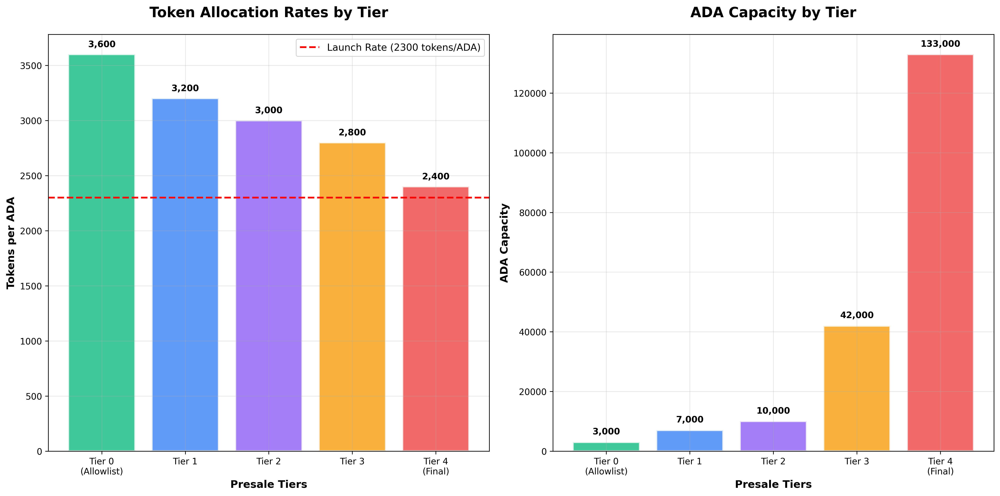
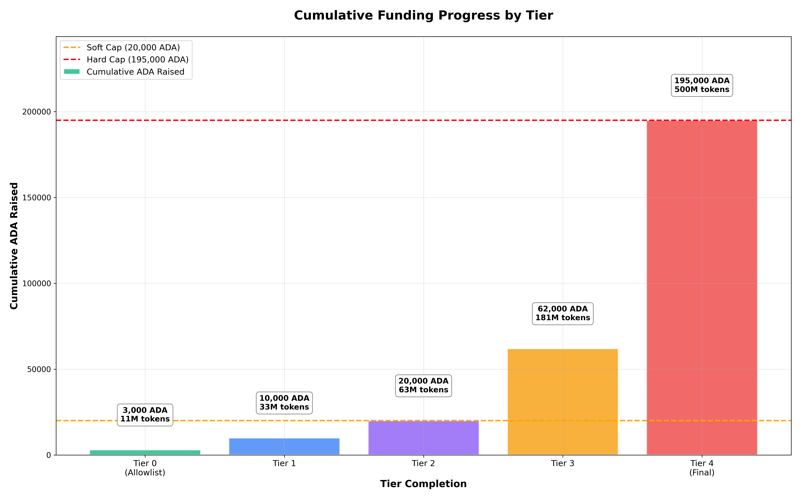
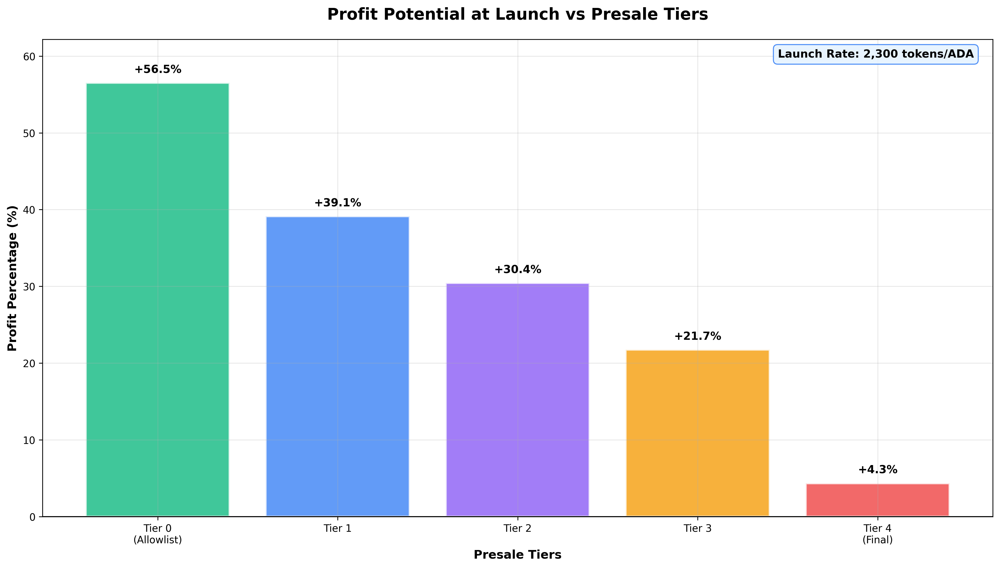

# POST Token Presale

Join the exclusive presale for the $POST token and be among the first to own a piece of the Proof of Post ecosystem. **Security guaranteed by Orca Labs.**

## Presale Overview

- **Token Symbol**: $POST
- **Total Supply**: 1,000,000,000 $POST
- **Presale Allocation**: 500,000,000 $POST (50% of total supply)
- **Minimum Purchase**: 100 ADA
- **Presale Period**: September 27, 2025 12:00 UTC → October 3, 2025 12:59 UTC
- **Presale Address**: `addr1q8xd2trvdsalrlnvmzkuqm97zyzxaulzfcn7xft5ydtfjxnm4n8qyfc5srfl7pfn8ucngtma8xzlxf4rv9k009xy4twq3jpahx`

## Funding Goals

- **Soft Cap**: 20,000 ADA *(Full refunds if not met)*
- **Hard Cap**: 195,000 ADA *(Presale ends when reached)*
- **Security Guarantee**: Presale backed and secured by Orca Labs

## Tiered Pricing Structure

The presale features a multi-tier pricing system with decreasing token allocation rates as funding increases:

### Tier Breakdown

#### Tier 0 (Allowlist) - **Best Value**
- **Rate**: 3,600 tokens per ADA
- **Allocation**: 3,000 ADA capacity
- **Total Tokens**: 10,800,000 $POST

#### Tier 1 - **High Value**
- **Rate**: 3,200 tokens per ADA
- **Allocation**: 7,000 ADA capacity
- **Total Tokens**: 22,400,000 $POST

#### Tier 2 - **Good Value**
- **Rate**: 3,000 tokens per ADA  
- **Allocation**: 10,000 ADA capacity
- **Total Tokens**: 30,000,000 $POST

#### Tier 3 - **Standard Rate**
- **Rate**: 2,800 tokens per ADA
- **Allocation**: 42,000 ADA capacity
- **Total Tokens**: 117,600,000 $POST

#### Tier 4 (Final) - **Last Opportunity**
- **Rate**: 2,400 tokens per ADA
- **Allocation**: 133,000 ADA capacity  
- **Total Tokens**: 319,200,000 $POST

### Cumulative Progress

### Token Distribution

- **Presale**: 50% (500,000,000 tokens)
- **Liquidity Pool**: 20% (200,000,000 tokens)
- **CEX Listings**: 5% (50,000,000 tokens)
- **Team & Development**: 25% (250,000,000 tokens)

## Launch Details

- **Launch Price**: 2,300 tokens per ADA *(Higher than final presale tier for instant profit)*
- **Initial Liquidity**: 200,000,000 tokens (20%) + 86,957 ADA
- **Profit Potential**: Up to +50% profit from Tier 0 rates at launch
- **CEX Funding**: 5% of total supply reserved for exchange listings

## Profit Potential Analysis

Based on current tier rates vs launch price (2,300 tokens/ADA):

- **Tier 0 (3,600/ADA)**: +56.5% profit at launch
- **Tier 1 (3,200/ADA)**: +39.1% profit at launch
- **Tier 2 (3,000/ADA)**: +30.4% profit at launch
- **Tier 3 (2,800/ADA)**: +21.7% profit at launch
- **Tier 4 (2,400/ADA)**: +4.3% profit at launch

> **Note**: Earlier tiers offer significantly higher profit potential due to better token rates compared to the launch price.

## How to Participate

1. **Visit Presale Page**: Access the official presale interface
2. **Connect Wallet**: Choose from Eternl, Lace, or Vespr
3. **Send ADA**: Minimum 100 ADA to participate
4. **Receive Allocation**: Tokens distributed automatically based on current tier
5. **Track Progress**: Monitor real-time presale progress and tier status

## Supported Wallets

- **[Eternl](https://eternl.io/)**: Advanced browser extension with hardware wallet support
- **[Lace](https://www.lace.io/)**: IOG's official wallet - popular choice
- **[Vespr](https://vespr.xyz/)**: Mobile-friendly community wallet

## Security & Compliance

### Security Guarantees
- **Orca Labs Backed**: Professional security guarantee from established Cardano development company
- **Smart Contract Audited**: Presale contract thoroughly reviewed for security vulnerabilities
- **On-Chain Transparency**: All transactions publicly verifiable on Cardano blockchain
- **Refund Protection**: Automatic refunds if soft cap (20,000 ADA) not reached

### Participation Requirements
- **Personal Wallets Only**: Do NOT send from exchanges - only from personal wallets
- **Minimum Contribution**: 100 ADA required to participate
- **Supported Networks**: Cardano Mainnet only
- **Transaction Records**: Keep your TX hash for potential refund processing

## Important Information

### Investment Risks
- Cryptocurrency investments carry inherent financial risks
- Token values may fluctuate significantly after launch
- Regulatory changes could impact the project
- Early-stage project with associated development risks

### Technical Requirements
- Compatible Cardano wallet (Eternl, Lace, or Vespr)
- Sufficient ADA balance for contribution + transaction fees
- Stable internet connection for wallet operations
- Basic understanding of Cardano wallet operations

## Get Started Now

### Step-by-Step Process

1. **Prepare Your Wallet**
   - Install Eternl, Lace, or Vespr wallet
   - Fund with ADA (minimum 100 + fees)
   - Ensure wallet is fully synced

2. **Access Presale**
   - Visit the official presale interface
   - Verify you're on the correct domain
   - Check presale status and current tier

3. **Participate**
   - Connect your wallet securely
   - Enter contribution amount (min 100 ADA)
   - Confirm transaction and receive allocation

4. **Track & Verify**
   - Monitor presale progress dashboard
   - Save transaction hash for records
   - Track tier progression in real-time

## Support & Resources

### Official Channels
- **Website**: [proofofpost.io](https://proofofpost.io/)
- **Twitter/X**: [@ProofOfPost_io](https://x.com/ProofOfPost_io)
- **Community**: Join our Discord for real-time support and updates

### Documentation
- **Tokenomics**: Detailed token distribution and utility
- **Revenue Share**: Platform profit sharing mechanisms
- **Roadmap**: Development timeline and milestones

---

## **Join the Future of On-Chain Social Media**

The $POST presale represents your opportunity to be part of the next evolution in social media - where creators own their content, earn directly from their audience, and participate in a truly decentralized platform built on Cardano.

**Secure your allocation today and become a founding member of the Proof of Post ecosystem!**
