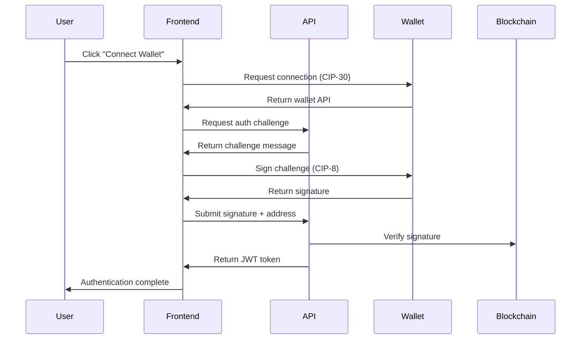

# Technical Architecture

Proof of Post is built on a modern, scalable architecture that seamlessly integrates traditional web technologies with Cardano blockchain capabilities. Here's how the platform is constructed:

## 🏗️ Core Technology Stack

### Frontend Architecture
- **Next.js 14** with App Router for modern React development
- **TypeScript** throughout for type safety and developer experience
- **Tailwind CSS** for responsive, utility-first styling
- **Framer Motion** for smooth, performant animations
- **Lucide React** for consistent iconography

### State Management & Data
- **Zustand** with persistence for client-side state
- **SQLite** with Drizzle ORM for efficient data management
- **JWT Authentication** with wallet signature verification
- **Client-side caching** with TTL for optimal performance

### Blockchain Integration
- **Lucid Cardano** for blockchain interactions
- **CIP-30 Wallet Support** for multi-wallet compatibility
- **Blockfrost API** for Cardano network data
- **CIP-8 Message Signing** for cryptographic verification


### Core Tables Schema

```sql
-- User identity and profiles
users (
  id, wallet_address, username, ada_handle,
  avatar_url, banner_url, bio, created_at
)

-- Content and posts
posts (
  id, user_id, content, signature, media_urls,
  reaction_counts, boost_count, reply_count, created_at
)

-- Social interactions
reactions (user_id, post_id, reaction_type, created_at)
follows (follower_id, following_id, created_at)
boosts (user_id, post_id, comment, created_at)
comments (id, user_id, post_id, content, created_at)
bookmarks (user_id, post_id, created_at)

-- Monetization
paid_posts (post_id, price_ada, unlock_count)
purchases (user_id, post_id, transaction_hash, created_at)
tips (from_user_id, to_post_id, amount, token, tx_hash)

-- Content organization
topics (id, name, post_count, trending_score)
tokens (id, policy_id, asset_name, ticker, metadata)
```

### Indexing Strategy
- **Composite indexes** on frequently queried combinations
- **Partial indexes** for active/recent content
- **Full-text search** on post content and user profiles
- **Time-based partitioning** for scalability

## 🔐 Authentication Flow

### Wallet Connection Process



### Session Management
- **JWT tokens** with wallet address binding
- **Signature verification** on sensitive operations
- **Session expiry** with automatic refresh
- **Multi-device support** with session tracking

## 📡 API Architecture

### RESTful Endpoints
```typescript
// Authentication
POST /api/auth/challenge     // Get signing challenge
POST /api/auth/verify        // Verify signature & login
POST /api/auth/refresh       // Refresh JWT token

// Content Management
GET  /api/posts             // Get feed posts
POST /api/posts             // Create new post
GET  /api/posts/:id         // Get specific post
POST /api/posts/:id/react   // Add reaction
POST /api/posts/:id/boost   // Boost/retweet post

// User Management
GET  /api/users/:id         // Get user profile
PUT  /api/profile           // Update own profile
GET  /api/profile/feed      // Get personalized feed
POST /api/profile/follow    // Follow/unfollow user

// Search & Discovery
GET  /api/search           // Search posts/users/tokens
GET  /api/topics           // Get trending topics
GET  /api/tokens           // Get token information

// Monetization
POST /api/payments/intent  // Create payment intent
POST /api/payments/verify  // Verify payment completion
GET  /api/payments/history // Get payment history
```

### Rate Limiting & Security
- **IP-based rate limiting** to prevent spam
- **User-based limits** for authenticated actions
- **CORS configuration** for secure cross-origin requests
- **Input validation** with Zod schemas

## 🌐 Blockchain Integration

### Cardano Network Interaction

```typescript
// Wallet connection with CIP-30
const wallet = await window.cardano[walletName].enable();
const api = await wallet.getApi();

// Message signing for authentication
const signature = await api.signData(
  Buffer.from(challenge).toString('hex'),
  Buffer.from(address).toString('hex')
);

// Transaction building for payments
const tx = await lucid
  .newTx()
  .payToAddress(recipientAddress, { lovelace: amount })
  .complete();

const signedTx = await tx.sign().complete();
const txHash = await signedTx.submit();
```

### ADA Handle Integration
- **Blockfrost API** for handle resolution
- **Automatic detection** when wallets connect
- **Handle verification** against on-chain data
- **Profile URL routing** with handle support

## 📁 File Storage & IPFS

### Decentralized Media Storage

```typescript
// IPFS upload process
const uploadToIPFS = async (file: File) => {
  const client = new Web3Storage({ token: process.env.WEB3_STORAGE_TOKEN });
  
  const cid = await client.put([file], {
    name: `post-media-${Date.now()}`,
    maxRetries: 3,
    wrapWithDirectory: false
  });
  
  return `https://${cid}.ipfs.w3s.link`;
};
```

### Media Processing Pipeline
- **Client-side resizing** for optimal upload sizes
- **Format validation** (images, videos, GIFs)
- **Preview generation** during upload
- **Watermarking** for paid content
- **Signed URLs** for secure access

## 🚀 Deployment & Scaling

### Production Architecture
```yaml
# Docker containerization
FROM node:18-alpine
WORKDIR /app
COPY package*.json ./
RUN npm ci --only=production
COPY . .
RUN npm run build
EXPOSE 3000
CMD ["npm", "start"]
```

### Environment Configuration
- **Mainnet/Testnet** blockchain network support
- **Environment variables** for API keys and secrets
- **Feature flags** for gradual rollouts
- **Monitoring** with error tracking and analytics

### Scaling Considerations
- **CDN integration** for static assets
- **Database connection pooling** for concurrent users
- **Redis caching** for session management
- **Load balancing** for high availability
- **Horizontal scaling** with container orchestration

## 🔍 Monitoring & Analytics

### Performance Monitoring
- **Core Web Vitals** tracking
- **API response times** monitoring
- **Database query performance** analysis
- **Blockchain interaction latency** tracking

### User Analytics
- **Engagement metrics** (posts, reactions, follows)
- **Content performance** analysis
- **Token interaction** tracking
- **Monetization metrics** for creators

---

This architecture ensures Proof of Post delivers a fast, secure, and scalable social media experience while maintaining the decentralized principles that make it unique in the social media landscape.

Next: Explore the [Social Media Features](../features/social-media.md) to see how users interact with the platform.
